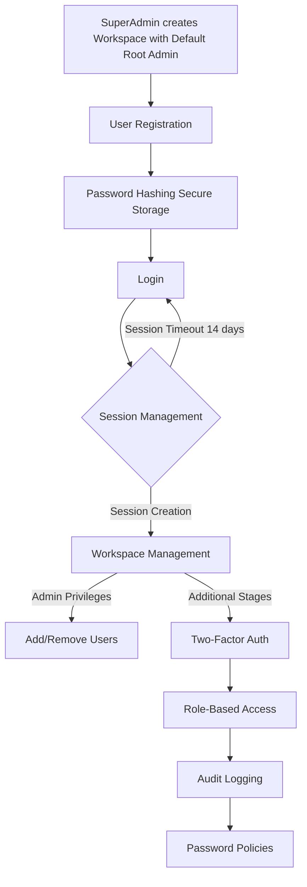

# Authentication System Design

JeevanConnect's authentication system is a collection of workspaces. A workspace is the primary entity which a user can access. A workspace consists group of users typically grouped under an organisation or some common attribute.

## Characters

- User: Main entity to interact with all the feature
- Admin: A user with some special priveleges in the workspace
- SuperAdmin: A user with access to all the workspaces in the database

## Design Decisions

### Accounts and Access

- Every user should sign up (create an account) using a email address and phone number with a WhatsApp account
- Email address/Phone number will be used as the username for login. Email address and Phone number should be unique for every user
- User registration and Workspace registration are independent of each other
- Forgot and Reset password options are based on email address or phone number verification

### Workspace

- Workspaces can be created only by the SuperAdmin with a root admin
- Admin of a workspace has the privelege to add and remove other users
- Admin can also convert other users into admins for the workspace
- To add a user, admin has to use the email address of the user
- Users can remove themselves from any workspaces
- A user can be in multiple workspaces but the workspaces are independent and closed
- Root Admin cannot be removed from a workspace
- A workspace can be archived (suspended) but cannot be deleted (i.e) all the data related to the workspace will be the database but only accessible to the SuperAdmin
- Features are allocated for the workspaces. Users in the workspace can use all the availed features based on the plan with more privileges to the admin user

For more information, see [Workspaces](workspaces.md)

## Models

- **User**: Email (key), First Name, Last Name, Designation, Contact
- **Workspace**: Workspace ID (key), Name, Address, Contact, Billing details, Plan and Feature access details, Users, Admins

## Authentication Mechanism

1. **Workspace Registration**: SuperAdmin should be create a Workspace with a default root Admin User

2. **User Registration**: Users can register themselves using their Email Address and Phone Number. Once, the User is added to a Workspace, they can access the features of the Workspace

3. **Verification during Registration**: Email and Phone number verification along with a reCaptcha verification is done during registration

4. **Password Security**: User passwords are securely hashed before storing them in the database. This ensures that even if the database is compromised, passwords remain protected

5. **Session Management**: Upon successful login, a session is created for the user, which is stored on the server. Users remain authenticated until they log out or their session expires. Users are required to login if a continuous 14 days of inactivity is detected

6. **Add User**: Admins of Workspace can add Users and a User can be in multiple Workspaces

7. **Workspace Admin**: Workspace admin have priveleges to add and remove other users in the Workspace

