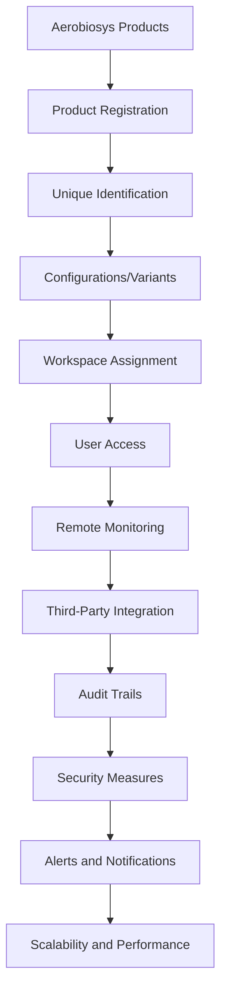

# Products Design

All the features available in JeevanConnect revolve around the products offered by Aerobiosys. Products include therapeutic and diagnostic equipments ranging from ventilators to imaging systems.

## Characters

- Product: A entity through which features are made available to the users
- Workspace: Products are allocated to workspaces and the users within the workspace should be able to use the products

## Design Decisions

- Products are registered in the framework during manufacturing, and upon purchase, they will be assigned to the workspace of the organization
- All the cloud features of the product should be accessible to the user via the JeevanConnect platform
- Each product will have a unique identification number (e.g., serial number) for tracking and management purposes
- Products may have different configurations or variants, and these should be accurately represented in the system
- Users within a workspace should have access to only the products assigned to their workspace, ensuring data segregation and security
- Admins should have the ability to manage product assignments, configurations, and access permissions within their workspace
- The system should support remote monitoring and diagnostic capabilities for products, allowing for proactive maintenance and troubleshooting
- Integration with third-party systems (e.g., healthcare information systems, electronic medical records) should be supported for seamless data exchange and interoperability
- Comprehensive audit trails should be maintained for all product-related activities, including configuration changes, usage logs, and access logs
- Robust security measures should be implemented, such as data encryption, secure communication protocols, and access controls, to protect sensitive product data and ensure compliance with relevant regulations (e.g., HIPAA, GDPR)
- The system should provide real-time alerts and notifications for critical events or issues related to products, enabling timely intervention and response
- Scalability and performance should be considered, ensuring that the system can handle a growing number of products, users, and workspaces without compromising performance or reliability

