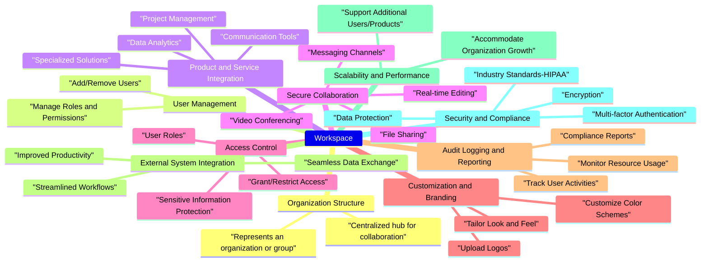

# Workspace Design

A workspace in JeevanConnect is a secure, collaborative environment designed to facilitate seamless communication, productivity, and access to various products and services offered by Aerobiosys. It is a centralized hub where users can engage with each other, interact with tools and applications, and leverage the functionality provided by our services.

## Characters

- User: Main entity to interact with all the features in the workspace. A user should be added to the workspace by the workspace's admin or super admin
- Admin: A user with some special priveleges in the workspace
- SuperAdmin: A user with access to all the workspaces in the database and has a ability to create new workspace

## Description

- A workspace represents an organization or a group of users with a common attribute. It should provide a dedicated space for teams to collaborate, share information, and access resources

- Workspaces should allow for granular user management, enabling administrators to add, remove, and manage user roles and permissions within the workspace. This ensures that access to sensitive information and functionalities is controlled and secure

- Aerobiosys offers a wide range of products and services that should be seamlessly integrated into JeevanConnect's workspaces. These include medical equipments, telemonitoring support, data analytics platforms, and other specialized solutions tailored to meet specific organizational needs

- Workspaces should facilitate secure collaboration by providing features such as file sharing, video conferencing, and messaging channels. Users should be able work together, share updates, and communicate effectively while maintaining data privacy and security adhered to HIPAA act

- Administrators should have the ability to define and enforce access controls within the workspace. They should be able to grant or restrict access to specific products, services, or areas of the workspace based on user roles, ensuring that sensitive information is available only to authorized individuals

- JeevanConnect should provide comprehensive audit logging and reporting capabilities within workspaces

- Workspaces should provide solutions to integrate with existing systems and applications used by an organization. This enables seamless data exchange by eliminating the need for manual data transfers or redundant processes

- JeevanConnect's workspaces should be designed to be highly scalable and performant, capable of accommodating organizations of various sizes and meeting their evolving needs. As an organization grows, the workspace can be easily expanded to support additional users, products, and services

